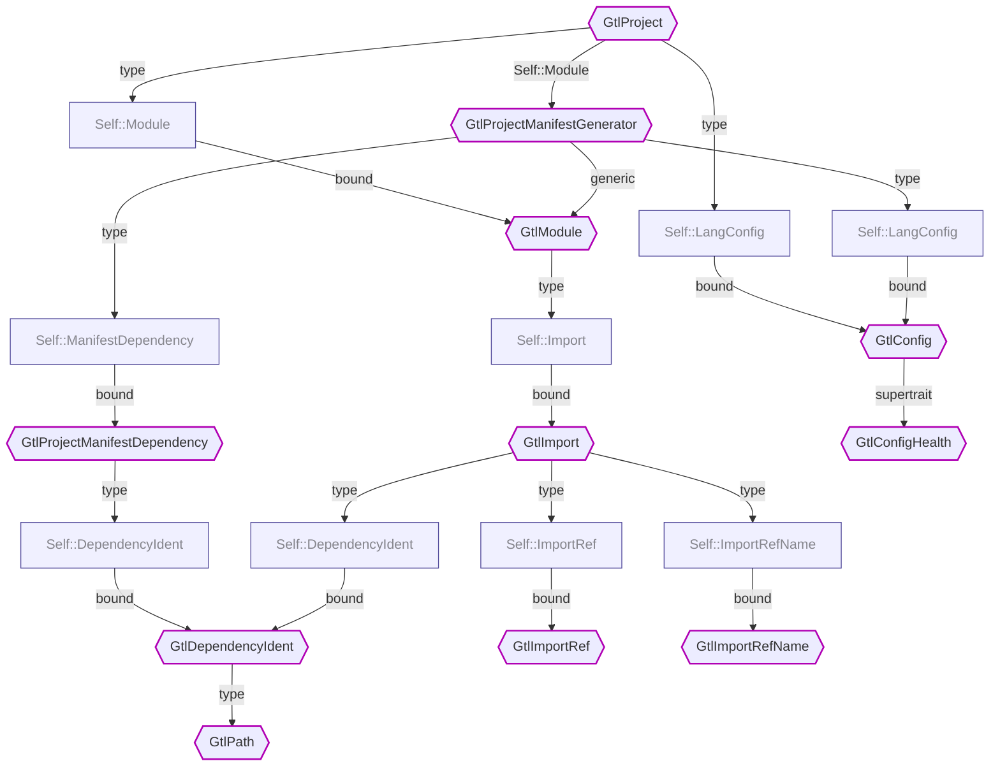

# Working On a New Target

## Target Project

### Traits to Implement

The starting point for implementing a new target project is `GtlProject`. It defines several supertrait and associated types with trait bounds that create chain reaction leading to a complete implementation of the target project.

Here's the `GtlProject` traits hierarchy chart:

