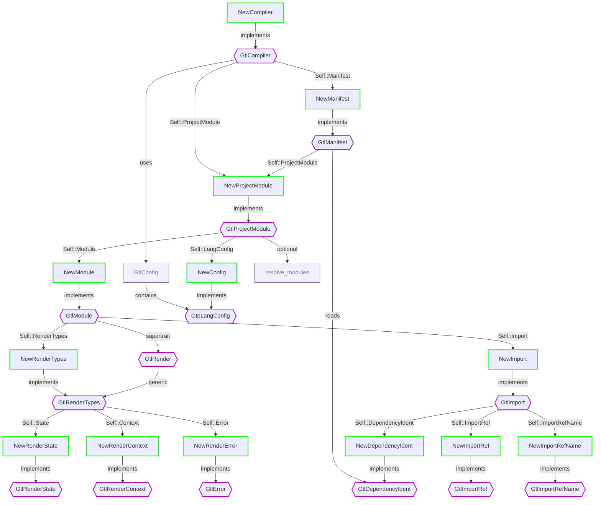

# Working On a New Target

## Target Project

### Traits to Implement

The starting point for implementing a new target project is `GtlCompiler`. It defines the target compiler, project module, and manifest types that create a chain reaction leading to a complete implementation of the target project.

Here's the `GtlCompiler` component hierarchy chart:

